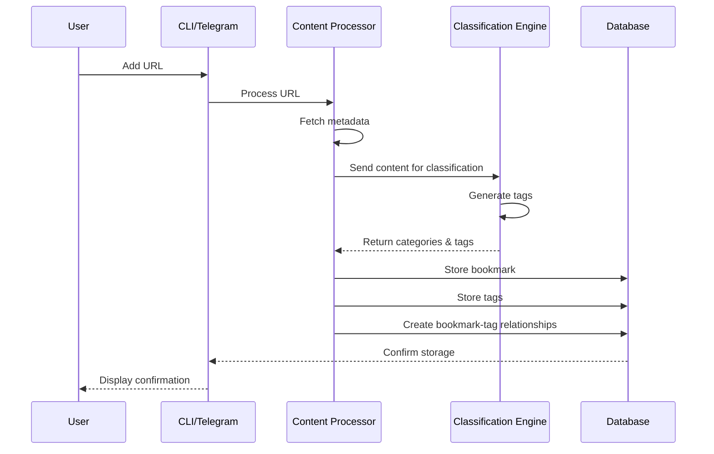
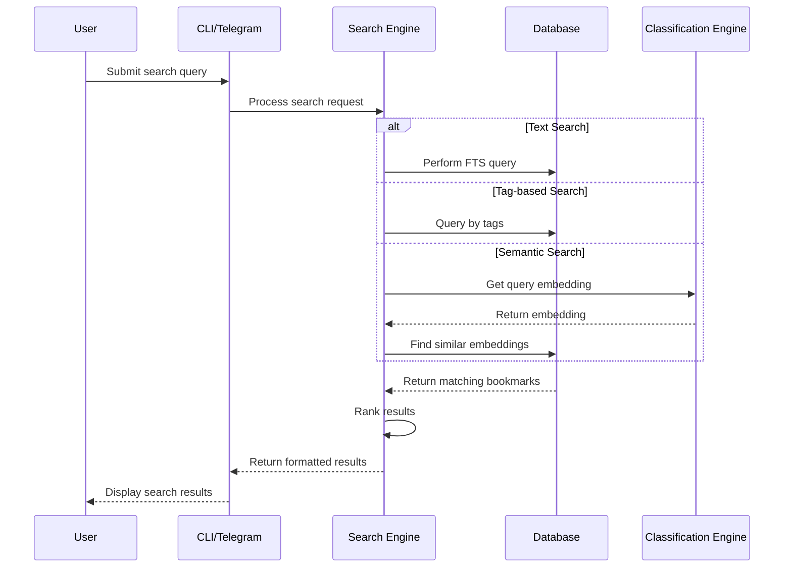
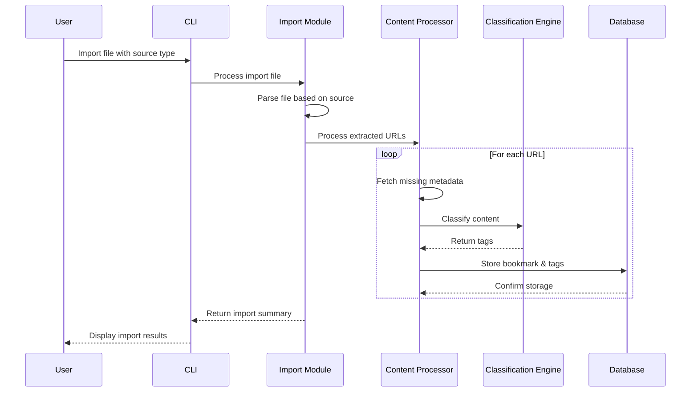
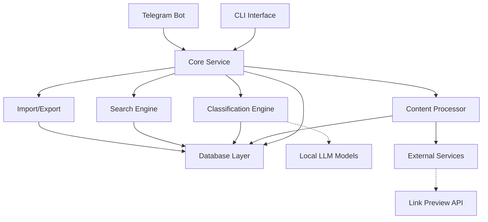
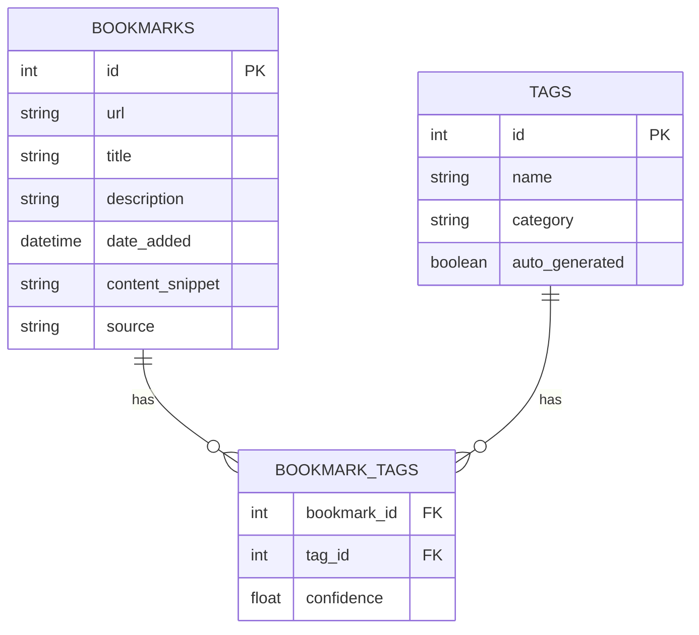

# Bookmark Manager Architecture Document

## 1. System Overview

The Bookmark Manager is a multi-platform tool for capturing, organizing, and retrieving bookmarks across devices with intelligent categorization. It follows a modular architecture with a local-first approach, enabling offline functionality with sync capabilities.

```
┌─────────────────────────────────────┐
│           User Interfaces           │
│  ┌─────────────┐    ┌────────────┐  │
│  │     CLI     │    │ Telegram   │  │
│  │  Interface  │    │    Bot     │  │
│  └─────────────┘    └────────────┘  │
└─────────────────────────────────────┘
              │              │
              ▼              ▼
┌─────────────────────────────────────┐
│           Core Services             │
│  ┌─────────────┐    ┌────────────┐  │
│  │   Content   │    │Classification│ │
│  │  Processor  │◄───│   Engine    │ │
│  └─────────────┘    └────────────┘  │
│          │                 ▲        │
│          ▼                 │        │
│  ┌─────────────┐    ┌────────────┐  │
│  │    Search   │    │  Import/   │  │
│  │    Engine   │    │   Export   │  │
│  └─────────────┘    └────────────┘  │
└─────────────────────────────────────┘
              │              │
              ▼              ▼
┌─────────────────────────────────────┐
│           Data Layer                │
│  ┌─────────────────────────────────┐│
│  │        SQLite Database          ││
│  │  ┌─────────┐ ┌─────┐ ┌───────┐  ││
│  │  │Bookmarks│ │Tags │ │ FTS5  │  ││
│  │  └─────────┘ └─────┘ └───────┘  ││
│  └─────────────────────────────────┘│
└─────────────────────────────────────┘
```

## 2. Core Modules and Objectives

| Module | Objective | Key Responsibilities |
|--------|-----------|----------------------|
| **Database** | Provide persistent storage with efficient retrieval | • Schema management<br>• CRUD operations<br>• Full-text search<br>• Transaction handling |
| **Content Processor** | Extract and normalize bookmark metadata | • URL validation<br>• Metadata extraction<br>• Content summarization<br>• Link preview generation |
| **Classification Engine** | Categorize bookmarks with ML/LLM | • Model management<br>• Text classification<br>• Tag generation<br>• Confidence scoring |
| **Search Engine** | Enable efficient bookmark retrieval | • Text search<br>• Tag-based filtering<br>• Semantic search<br>• Result ranking |
| **Import/Export** | Support data migration between systems | • Format parsing<br>• Batch processing<br>• Source-specific adapters<br>• Export generation |
| **CLI Interface** | Provide command-line access to functionality | • Command parsing<br>• User interaction<br>• Output formatting<br>• Help system |
| **Telegram Bot** | Enable mobile access via messaging | • Message handling<br>• Command processing<br>• URL detection<br>• User authentication |
| **Error Handler** | Ensure robust operation | • Exception catching<br>• Logging<br>• User feedback<br>• Recovery strategies |

## 3. Data Model

```
┌───────────────────┐       ┌───────────────────┐
│    bookmarks      │       │       tags        │
├───────────────────┤       ├───────────────────┤
│ id: INTEGER [PK]  │       │ id: INTEGER [PK]  │
│ url: TEXT         │       │ name: TEXT        │
│ title: TEXT       │       │ category: TEXT    │
│ description: TEXT │       │ auto_generated:   │
│ date_added: DATE  │       │     BOOLEAN       │
│ content_snippet:  │       └─────────┬─────────┘
│     TEXT          │                 │
│ source: TEXT      │                 │
└────────┬──────────┘                 │
         │                            │
         │       ┌───────────────────┐│
         └───────┤   bookmark_tags   ├┘
                 ├───────────────────┤
                 │ bookmark_id: INT  │
                 │ tag_id: INT       │
                 │ confidence: FLOAT │
                 └───────────────────┘
```

## 4. Key Process Flows

### 4.1 Bookmark Addition Flow



### 4.2 Search Flow



### 4.3 Import Process



## 5. Component Interactions

```
┌─────────────────────────────────────────────────────────────┐
│                       User Interfaces                       │
└───────────────────────────┬─────────────────────────────────┘
                            │
                            ▼
┌─────────────────────────────────────────────────────────────┐
│                      Service Mediator                       │
└───┬───────────────┬───────────────────┬───────────────────┬─┘
    │               │                   │                   │
    ▼               ▼                   ▼                   ▼
┌─────────┐   ┌───────────┐      ┌────────────┐     ┌────────────┐
│ Content │   │ Search    │      │ Import/    │     │Classification│
│Processor│◄──│ Engine    │      │ Export     │     │  Engine     │
└────┬────┘   └─────┬─────┘      └─────┬──────┘     └──────┬─────┘
     │              │                  │                    │
     │              │                  │                    │
     └──────────────┴──────────┬───────┴────────────────────┘
                               │
                               ▼
                      ┌─────────────────┐
                      │  Data Access    │
                      │     Layer       │
                      └────────┬────────┘
                               │
                               ▼
                      ┌─────────────────┐
                      │    Database     │
                      └─────────────────┘
```

## 6. Deployment Architecture

```
┌─────────────────────────────────────────────────────────────┐
│                     User's Local Machine                    │
│                                                             │
│  ┌─────────────┐    ┌─────────────┐    ┌─────────────────┐  │
│  │             │    │             │    │                 │  │
│  │  Python     │    │  SQLite     │    │  LLM Models    │  │
│  │  Runtime    │    │  Database   │    │  (Local/Quant) │  │
│  │             │    │             │    │                 │  │
│  └─────────────┘    └─────────────┘    └─────────────────┘  │
│                                                             │
└─────────────────────────────────────────────────────────────┘
                           │
                           │ Optional: Synchronization
                           ▼
┌─────────────────────────────────────────────────────────────┐
│                    Cloud Services (Optional)                │
│                                                             │
│  ┌─────────────┐    ┌─────────────┐    ┌─────────────────┐  │
│  │             │    │             │    │                 │  │
│  │  Telegram   │    │  GitHub     │    │  Heroku        │  │
│  │  Bot API    │    │  (Storage)  │    │  (Web Service) │  │
│  │             │    │             │    │                 │  │
│  └─────────────┘    └─────────────┘    └─────────────────┘  │
│                                                             │
└─────────────────────────────────────────────────────────────┘
```

## 7. Module Relationships and Dependencies



## 8. Database Schema Diagram



## 9. Key Technology Selection Rationale

| Component | Technology Choice | Rationale |
|-----------|-------------------|-----------|
| Database | SQLite | • File-based for portability<br>• No server required<br>• FTS5 extension for search<br>• Good performance for expected load |
| Classification | DistilBERT + Phi-3 Mini | • DistilBERT is lightweight for basic classification<br>• Phi-3 Mini provides more advanced capabilities when needed<br>• Both can run locally |
| CLI Framework | Click | • Modern Python CLI framework<br>• Good documentation<br>• Extensible command structure |
| Telegram | python-telegram-bot | • Well-maintained library<br>• Good documentation<br>• Support for modern Telegram features |
| Content Extraction | Beautiful Soup + Requests | • Industry standard for web scraping<br>• Mature libraries with wide support |

## 10. Development Architecture

```
┌─────────────────────────────────────┐
│         Development Pipeline        │
│                                     │
│  ┌─────────┐     ┌───────────────┐  │
│  │         │     │               │  │
│  │  Tests  │────►│  CI Pipeline  │  │
│  │         │     │               │  │
│  └─────────┘     └───────┬───────┘  │
│                          │          │
│  ┌─────────┐     ┌───────▼───────┐  │
│  │         │     │               │  │
│  │ Linting │────►│    Build     │  │
│  │         │     │               │  │
│  └─────────┘     └───────────────┘  │
│                                     │
└─────────────────────────────────────┘
```

## 11. Security Considerations

1. **Data Privacy**
   - All processing happens locally by default
   - No data shared with external services without explicit configuration
   - Local LLM usage prevents data exposure

2. **Authentication**
   - Telegram bot uses token-based authentication
   - Bot can be configured for individual user or group access
   - Export files do not contain sensitive information

3. **Data Integrity**
   - Database transactions ensure ACID properties
   - Regular backup recommendations
   - Import validation prevents malformed data

## 12. Future Extension Points

1. **Browser Extension**
   - Integration point with web browsers
   - One-click bookmark saving
   - Browser synchronization

2. **Web Interface**
   - Optional self-hosted web UI
   - Mobile-friendly design
   - Multi-user support

3. **Advanced Sync**
   - Cloud storage integration
   - Cross-device synchronization
   - Conflict resolution

4. **API Layer**
   - REST API for third-party integration
   - Webhook support
   - Custom plugin system

This architecture document serves as a blueprint for the Bookmark Manager project, providing a comprehensive overview of all components and their interactions. It can be used as a reference for developers implementing the system and for future extensions.